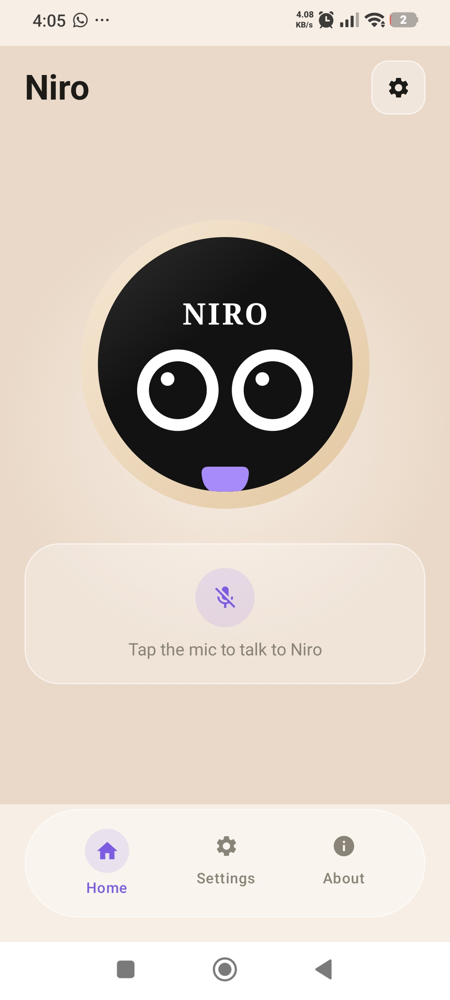
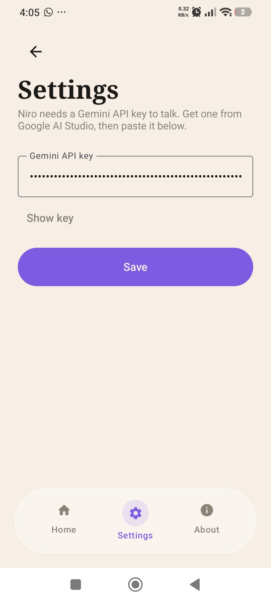

🤍 Niro

A warm, caring & slightly cute AI companion for Android.

  

Niro is a modern AI companion for Android, designed to make AI conversations feel more natural, personal, and human.

Niro isn't just about getting answers — it's about having an assistant that feels friendly, calm, caring, and easy to talk to.

---

✨ Features

- 💬 Natural AI Conversations
  Talk with Niro naturally and get helpful responses.

- 🤍 Warm Personality
  Niro is designed to be caring, friendly, supportive, and slightly cute.

- 🧠 AI-Powered Assistance
  Ask questions, solve problems, learn, brainstorm, and get help with everyday tasks.

- 📱 Android-First Experience
  Designed specifically for a comfortable mobile experience.

- 🎨 Modern Interface
  Clean, minimal, polished, and easy to use.

- ⚡ Fast & Simple
  Start a conversation without unnecessary complexity.

- 🔒 Privacy-Conscious
  Built with privacy and secure handling of information in mind.

---

📱 Screenshots

  

  
  
  

---

🚀 Installation

Android

Download the latest APK from the Releases section of this repository.

1. Download the latest "Niro.apk".
2. Open the APK on your Android device.
3. Allow installation from unknown sources if Android asks.
4. Install Niro.
5. Open the app and start chatting.

«Note: Only install APK files from sources you trust.»

---

🧑‍💻 Development

Clone the repository:

git clone https://github.com/bhagyaff001-prog/Niro.git
cd Niro

Open the project in your development environment and build the application.

---

🛠️ Built With

Niro is built with a focus on:

- 📱 Android
- 🤖 AI-powered conversations
- 🎨 Modern UI/UX
- ⚡ Performance
- 🔐 Security
- 💡 Simplicity
- 🤍 Natural interaction

---

🗺️ Roadmap

Niro is continuously evolving.

- [ ] Better AI conversations
- [ ] Long-term memory
- [ ] Voice input
- [ ] Voice responses
- [ ] Personalized conversations
- [ ] More AI tools
- [ ] Custom themes
- [ ] Improved animations
- [ ] Notifications
- [ ] More Android integrations

---

🤝 Contributing

Want to help make Niro better?

Contributions, suggestions, bug reports, and feature requests are welcome.

Contribute

1. Fork this repository.
2. Create a feature branch:

git checkout -b feature/my-feature

3. Make your changes.
4. Commit your changes:

git commit -m "Add my feature"

5. Push your branch:

git push origin feature/my-feature

6. Open a Pull Request.

---

🐛 Issues & Suggestions

Found a bug or have an idea?

Open an Issue in this repository and describe the problem or feature you'd like to see.

---

🤍 About Niro

Niro was created with a simple idea:

«AI doesn't always have to feel robotic.»

Niro aims to make everyday AI interaction feel warmer, more comfortable, and more human.

Whether you need help with something, want to learn, need an idea, or simply want a friendly conversation — Niro is here.

---

👨‍💻 Creator

Bhagya Gujju

Built with 🤍 and a lot of curiosity.

---

📄 License

See the "LICENSE" file in this repository for the applicable license.

---

Niro 🤍

Your warm AI companion.

Made with care.

